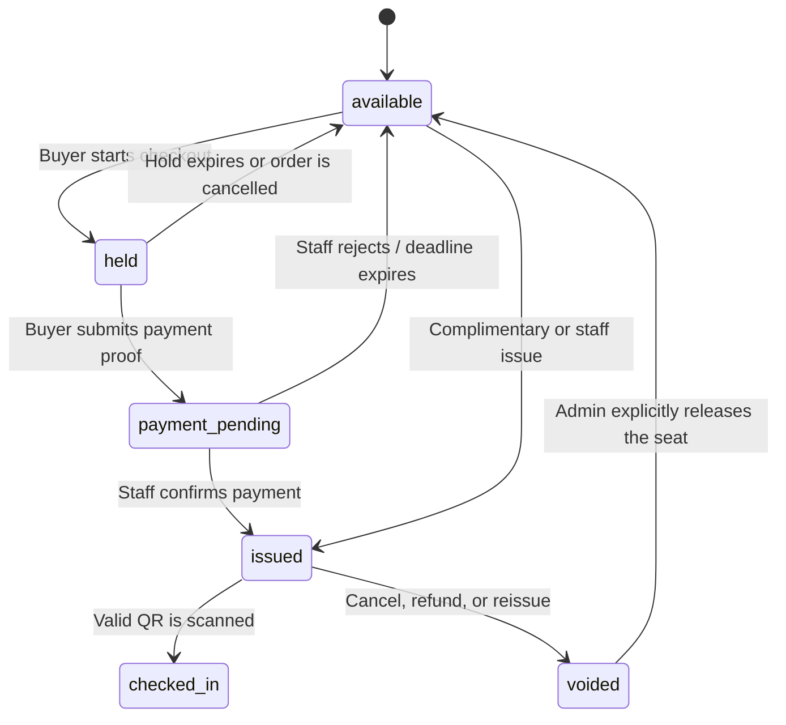

# PRD: Direct Seat Ticketing for Manohra

## 1. Summary

FaceBotStudio will sell and distribute a controlled allocation of seats directly, while Ticketmelon continues to sell every other seat. The direct allocation supports VIP, special-price, complimentary, and named or bearer tickets.

The system will treat Ticketmelon-locked seats as the only seats available in FaceBotStudio. All other seats visible in the venue plan are unavailable in FaceBotStudio and remain Ticketmelon's inventory.

The first release deliberately uses PromptPay QR payment plus manual verification. A payment gateway, automated bank callback, and a real-time Ticketmelon integration are not required to begin selling.

## 2. Background and problem

The Manohra event uses Ticketmelon for public, reserved-seat sales. The organizer needs a separate direct-sales allocation to:

- sell special-price tickets without exposing that allocation publicly on Ticketmelon;
- issue premium VIP and complimentary tickets with a branded graphic;
- show the exact performance, zone, row, and seat;
- send tickets privately as a mobile image or PDF and print them;
- let a customer select only seats locked for the organizer;
- accept PromptPay payment and verify payment before releasing a ticket;
- check tickets in at the venue without issuing the same seat twice.

## 3. Product principles

1. **One inventory owner per seat.** A seat is either Ticketmelon's public inventory or FaceBotStudio's direct allocation, never both.
2. **Ticketmelon lock first.** A seat must be locked in Ticketmelon before it is imported to FaceBotStudio.
3. **FaceBotStudio is the source of truth for the direct allocation.** The system does not scrape or continuously synchronize Ticketmelon seat availability.
4. **No ticket before payment approval.** Paid tickets stay pending until a staff member verifies payment; complimentary tickets may issue immediately.
5. **A voided QR never comes back.** Reissuing creates a new ticket and invalidates the prior ticket.
6. **Simple before automatic.** Manual payment verification comes before bank APIs, payment gateways, or real-time webhooks.

## 4. Users and roles

| Role | Main permissions |
| --- | --- |
| Buyer | Select eligible seat, create an order, pay by PromptPay, upload payment proof, access issued ticket. |
| Operator | Create direct orders, hold seats, review payment proof, issue/reissue tickets. |
| Admin / owner | Import seat allocation, configure sessions, ticket types, prices, visual template, payment details, void/refund tickets, export reports. |
| Door staff | Scan and validate a direct-ticket QR; see result, guest, performance, and seat without admin access. |

## 5. Scope

### In scope

- Three independently sellable performance sessions.
- Importing a locked seat allocation from a CSV and using a venue/Ticketmelon seat-plan image as the backdrop.
- An inverted public seat plan: only imported direct-allocation seats can be selected.
- Direct paid, special-price, VIP, and complimentary ticket types.
- PromptPay QR payment request, manual payment verification, and optional slip upload.
- Seat holds, ticket issue, void, reissue, and audit history.
- Branded mobile ticket PNG, print-ready A6 PDF, and batch A4 print sheets.
- Direct-ticket check-in, including repeated-scan warning.
- Reconciliation and exports.

### Explicitly out of scope for the first release

- Taking card payments or building a payment gateway.
- A public API or live inventory synchronization with Ticketmelon.
- Scraping Ticketmelon's seat plan or sales data.
- A venue-wide seat-map editor for Ticketmelon-owned seats.
- Buyer-to-buyer transfer, resale marketplace, discounts calculated from complicated rules, or loyalty features.
- Full offline check-in/PWA mode.

## 6. Required setup data

Before development or import, the organizer provides:

1. A seat-plan background for each layout: SVG preferred; PDF or high-resolution PNG acceptable.
2. A CSV of Ticketmelon-locked inventory for each performance. Required columns:

   ```csv
   performance_code,zone,row,seat,external_seat_ref,face_value
   R1,Premium,C,C01,TM-R1-PREMIUM-C01,1500
   ```

3. The date/time, title, and cast note for all three performance sessions.
4. Ticket types, direct prices, benefits, and whether the ticket may be bearer/unnamed.
5. PromptPay receiver name and receiver identifier; the receiver name must be displayed to the buyer.
6. A ticket background/logo/terms and the intended print instructions.

## 7. Seat and ticket lifecycle



### Hold rules

- A new buyer hold lasts 15 minutes by default.
- Once proof is uploaded, staff may extend the hold for review; the extension is recorded.
- An expired hold releases the seat automatically.
- A payment received after the seat was released is resolved manually; the system must not silently assign another seat.
- The database must prevent two active orders/tickets from owning the same `performance + zone + row + seat`.

## 8. Core user flows

### 8.1 Fast direct sale through Facebook or staff

1. Buyer contacts the organizer on Facebook/Messenger.
2. Operator chooses a direct seat in FaceBotStudio and creates an order.
3. The system holds the seat and provides a payment URL or order reference.
4. Operator sends PromptPay QR in chat; buyer sends payment proof.
5. Operator checks the receiving-bank app, marks the order `paid`, and issues the ticket.
6. System sends or opens the branded ticket PNG/PDF.

This flow is the first production milestone because it can be used before the public seat-selection page exists.

### 8.2 Buyer selects a direct seat independently

1. Buyer opens a FaceBotStudio direct-ticket URL from Facebook, LINE, or the event page.
2. Buyer selects a performance session.
3. The seat plan displays Ticketmelon-owned seats as disabled. Only imported direct seats are selectable.
4. Buyer selects a seat, enters contact details, and sees the exact total and payment deadline.
5. System creates a hold and displays a PromptPay QR plus Order ID.
6. Buyer uploads a payment slip.
7. Staff approves or rejects payment.
8. On approval, the system issues the ticket and delivers its private link.

### 8.3 Complimentary/VIP guest

1. Admin selects an available seat or a batch of seats.
2. Admin chooses `complimentary` and ticket class, optionally adds a guest name.
3. The system issues the ticket immediately and records the issuing user/reason.
4. Admin downloads a branded PNG/PDF or batch print sheet.

### 8.4 Door validation

1. Door staff opens a restricted check-in link.
2. Staff scans the direct-ticket QR.
3. System displays a clear green, amber, or red result with guest, ticket class, performance, and seat.
4. First valid scan changes the ticket to `checked_in`.
5. A repeated scan is an amber warning, not another success.

## 9. Payment verification: first release

### Payment states

`not_required`, `awaiting_payment`, `proof_submitted`, `verified`, `rejected`, `expired`, `refunded`.

### Manual verification checklist

Staff must compare the payment proof with the order and receiving-bank transaction:

- recipient account/name matches the configured receiver;
- amount matches the order total;
- transaction date/time is within the order window;
- reference/transaction ID has not already been used;
- staff records who verified it and when.

The ticket is issued only after the status is `verified`.

### Later automation

An optional slip-verification service may parse the slip payload and validate recipient, amount, date/time, and duplicate transaction reference. It may auto-approve only when every validation passes; otherwise it queues staff review. Dynamic Thai QR with a bank/payment-provider webhook is a later replacement, not a prerequisite.

## 10. Ticket design and delivery

Every direct ticket must show:

- event title and event artwork;
- ticket class: VIP, Special, or Complimentary;
- performance date and start time;
- zone, row, and seat, prominently;
- guest name when known;
- QR plus a short human-readable ticket code;
- essential entry terms and VIP benefits;
- organizer/contact information.

Outputs:

| Output | Purpose |
| --- | --- |
| Mobile PNG | Private delivery through chat/email and phone wallet/gallery. |
| A6 PDF with 3 mm bleed | Premium individual print. |
| A4 4-up PDF with crop marks | Office or print-shop batch printing. |
| CSV export | Door list, sales reconciliation, and backup. |

Use 250–300 gsm matte stock for VIP cards. Keep the QR black on a white field, at least 30 mm wide, with a clear quiet zone; do not place a glossy overlay over it.

## 11. Security and audit requirements

- Direct-ticket QR values must use a cryptographically secure opaque token, not a short sequential/guessable identifier.
- Store a token hash rather than the raw token where possible.
- Ticket-view URLs must be private and unguessable.
- Payment proof must be private; it must never be placed in public uploads.
- Keep audit events for seat import, hold, payment decision, issue, delivery, void, reissue, and check-in.
- Reissue voids the old QR before generating the new one.
- Admin/operator actions require authenticated, event-scoped access. Door staff use restricted check-in links only.

## 12. Data model (target)

| Entity | Important fields |
| --- | --- |
| `event_performances` | `id`, `event_id`, `code`, `title`, `starts_at`, `ends_at`, `ticketmelon_reference` |
| `seat_inventory` | `id`, `performance_id`, `zone`, `row_label`, `seat_label`, `external_seat_ref`, `x`, `y`, `status` |
| `direct_orders` | `id`, `event_id`, `performance_id`, `buyer_name`, `phone`, `email`, `total_amount`, `payment_status`, `hold_expires_at` |
| `direct_tickets` | `id`, `order_id`, `seat_id`, `ticket_class`, `holder_name`, `price`, `status`, `qr_token_hash`, `issued_at`, `checked_in_at` |
| `payment_attempts` | `id`, `order_id`, `expected_amount`, `slip_private_url`, `bank_transaction_ref`, `status`, `verified_by`, `verified_at` |
| `seat_plan_assets` | `id`, `event_id`, `layout_version`, `asset_url`, `width`, `height` |

`seat_inventory` must have a unique constraint across `performance_id + zone + row_label + seat_label`. `direct_tickets` must enforce one non-voided ticket per seat.

The existing registration/check-in records remain compatible for current registrations. Direct tickets are a separate model because they may be issued before a guest name is known and require their own payment, seat, and QR lifecycle.

## 13. Phased delivery plan

### Phase 0 — Commercial and data readiness

**Goal:** Establish a safe allocation boundary before any code is released.

- Confirm permanent locked seats with Ticketmelon for every performance.
- Resolve schedule/branding discrepancies across FaceBotStudio and Ticketmelon.
- Obtain plan asset and allocation CSV.
- Approve ticket classes, prices, PromptPay receiver, hold duration, refund/late-payment policy, and ticket artwork.

**Exit criteria:** A sample import covers one session; each imported seat is visibly locked from Ticketmelon public sale.

### Phase 1 — Admin direct-ticket MVP

**Goal:** Staff can sell or give a reserved seat without public checkout.

- Add performance, seat inventory, direct order, direct ticket, and payment-attempt storage.
- Add CSV import with duplicate/error preview and audit log.
- Add admin seat list/filter: performance, zone, row, seat, status.
- Add create order, manual hold, mark payment verified/rejected, complimentary issue, void, and reissue.
- Add secure direct QR, ticket PNG, A6 PDF, and batch A4 printing.
- Extend check-in to validate direct tickets and visibly flag repeat scans.
- Add CSV sales/reconciliation export.

**Acceptance criteria:**

- Two operators cannot issue the same seat.
- A manual paid order produces a ticket with correct round/zone/row/seat.
- A voided or superseded QR is refused at check-in.
- Door staff can validate a direct ticket without full admin access.
- A daily report reconciles every imported seat as available, held, issued, or voided.

### Phase 2 — Buyer seat selection and manual payment proof

**Goal:** Buyers can self-select the organizer allocation and submit proof for staff approval.

- Add public direct-ticket route linked from Facebook/event page.
- Add inverted interactive seat plan: only direct inventory is clickable.
- Add 15-minute hold expiration and automatic release.
- Generate PromptPay payment request with exact order total and clear receiver name.
- Add private slip upload and a staff payment-review queue.
- Deliver ticket link after approval; show pending/rejected/expired messages appropriately.

**Acceptance criteria:**

- Ticketmelon-owned seats cannot be selected on the FaceBotStudio plan.
- A selected seat becomes unavailable to another buyer immediately.
- Expired holds return to available automatically.
- Uploading a slip does not issue a ticket; staff approval is required.
- The buyer cannot access another buyer's ticket or payment proof.

### Phase 3 — Semi-automated verification

**Goal:** Reduce staff verification workload without trusting screenshots blindly.

- Integrate a chosen slip-verification provider.
- Validate amount, receiver, transaction time, and duplicate transaction reference.
- Auto-approve only strict matches; route exceptions to staff review.
- Add payment-decision notifications and reporting.

**Acceptance criteria:**

- The same verified transaction reference cannot pay two orders.
- A wrong amount/recipient is never auto-approved.
- Every automatic decision remains auditable and can be manually overridden by an admin.

### Phase 4 — Full payment and Ticketmelon collaboration options

**Goal:** Automate payment confirmation and, if available, unify entry credentials.

- Evaluate bank/acquirer Dynamic Thai QR webhook integration.
- If Ticketmelon supports official manual/complimentary tickets and QR export/API, support embedding the official Ticketmelon QR in the FaceBotStudio branded ticket.
- Keep a single check-in authority where Ticketmelon integration makes that possible.
- Add optional public special-ticket sales rules only after operational results justify them.

**Acceptance criteria:**

- Payment notification is idempotent and cannot double-issue tickets.
- Failed/missing notifications can be reconciled by inquiry or staff review.
- Ticketmelon and FaceBotStudio allocations cannot overlap.

## 14. Delivery order inside Phase 1

1. Database migrations and domain/service layer.
2. Seat import and seat-level concurrency guard.
3. Admin order/payment decision workflow.
4. Ticket renderer and secure QR/token validation.
5. Check-in integration and role-restricted check-in link.
6. Exports, audit trail, and test coverage.

This order lets the team test the business rule that matters most—no duplicate seat sale—before investing in the public graphical map.

## 15. Risks and mitigations

| Risk | Mitigation |
| --- | --- |
| Same seat becomes sellable in both systems | Lock in Ticketmelon first; import only locked allocation; reconciliation before each sales session. |
| Buyer pays after a hold expires | State the deadline clearly; queue for staff resolution rather than silently assigning another seat. |
| Fake or reused payment slip | Manual receiving-bank check in Phase 1; later validate recipient/amount/time/transaction reference with slip verification. |
| QR shared or copied | Opaque QR token, one-time check-in, reissue/void workflow, repeated-scan warning. |
| Poor internet at venue | Printed/CSV backup list; test venue connectivity before event; offline mode is a later feature. |
| Incorrect session information printed | Store performance as a first-class entity and preview a sample ticket for every session before batch issue. |
| Ticketmelon allocation changes | Version imports and require admin reconciliation before releasing/adding seats. |

## 16. Open decisions

- Does Ticketmelon provide official QR/PDF data for manually issued or complimentary locked seats?
- Which exact zones/seats are allocated to direct sale for each performance?
- Is a ticket transferable, named-only, or permitted to be bearer?
- What is the payment deadline and the policy for late payment/refund?
- Which staff members may approve payment, void tickets, and reissue tickets?
- Does the event need a FaceBotStudio-only VIP entry lane, or can Ticketmelon QR be used as the unified gate credential?

## 17. Implementation status

- Phase 0: operating checklist documented; real Ticketmelon allocation, artwork, commercial policy, and credentials remain organizer inputs.
- Phase 1: implemented — performance/seat import, concurrency guard, manual payment decisions, signed QR, branded PNG, A6 PDF, A4 4-up print, reissue/void, check-in, audit, sales and seat reconciliation exports.
- Phase 2: implemented — public direct-seat selection, inverted allocation, 15-minute hold/release, exact PromptPay QR, private proof upload, manual review, status recovery, and private ticket delivery.
- Phase 3: implemented as an optional provider-neutral signed callback with strict amount, receiver, time, and duplicate-reference checks. A live provider still requires its credentials and adapter mapping.
- Phase 4: integration boundary documented. Dynamic QR and official Ticketmelon credential sharing cannot be activated until the bank/acquirer and Ticketmelon provide official APIs, credentials, and authority rules.
