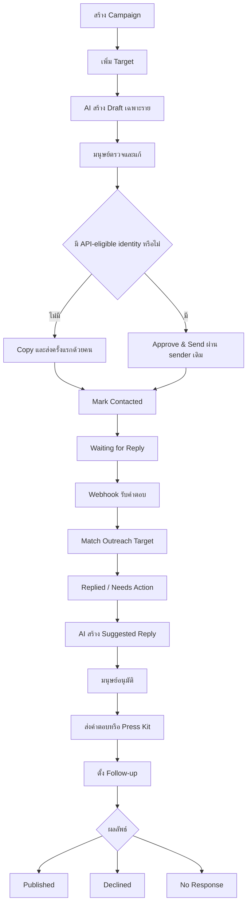

# PRD: Press Outreach Module

## 1. สรุปผลิตภัณฑ์

FaceBotStudio จะเพิ่มโมดูล `Outreach` สำหรับจัดการการติดต่อสื่อ องค์กร เพจ Facebook มหาวิทยาลัย และผู้เกี่ยวข้องกับกิจกรรม โดยใช้ AI ช่วยร่างข้อความเฉพาะราย แต่ให้มนุษย์ตรวจและอนุมัติก่อนส่งทุกครั้ง

Use case แรกคือ `Manohra: Thai Choral Opera — Press & Media Outreach` ตั้งแต่เตรียมรายชื่อสื่อ ร่างข้อความ ติดต่อ ติดตามคำตอบ ส่ง Press Kit ไปจนถึงบันทึกผลลัพธ์ว่าเผยแพร่ ปฏิเสธ หรือไม่มีการตอบกลับ

โมดูลนี้เป็นส่วนหนึ่งของ FaceBotStudio และต้องใช้ authentication, event scope, database, Facebook channel, webhook, message history, AI provider, audit log, rate limit และ UI system ที่มีอยู่แล้ว ห้ามสร้าง Facebook/Meta integration ชุดใหม่โดยไม่มีเหตุผลทางเทคนิคที่พิสูจน์ได้

## 2. ปัญหาและโอกาส

การทำ press outreach ปัจจุบันต้องกระจายงานระหว่าง spreadsheet, Facebook, Messenger, ไฟล์ Press Kit และบันทึกส่วนตัว ทำให้ทีมพบปัญหา:

- ไม่ทราบว่าใครถูกติดต่อแล้ว ใครตอบแล้ว และใครถึงกำหนดติดตาม;
- ข้อความซ้ำหรือทั่วไปเกินไปจนดูเป็น mass spam;
- ประวัติการสนทนาและไฟล์ที่เคยส่งไม่อยู่ในที่เดียวกัน;
- ทีมอาจตอบซ้ำ ส่ง Press Kit ซ้ำ หรือพลาดคำขอสัมภาษณ์;
- การใช้ AI โดยไม่แยก context อาจทำให้ข้อมูล campaign ปนกับ Auto Reply สำหรับลูกค้า;
- Meta API ไม่รับประกันว่าเพจจะเริ่มบทสนทนากับ target ที่ไม่เคยคุยกันได้

FaceBotStudio มี webhook, conversation storage, manual messaging และ AI infrastructure อยู่แล้ว จึงสามารถเพิ่ม workflow นี้โดยไม่สร้าง application ใหม่

## 3. เป้าหมาย

1. ให้ทีมสร้าง campaign และจัดการ target ทั้งหมดจาก FaceBotStudio
2. ให้ AI สร้างข้อความที่อิง campaign และข้อมูลของ target โดยไม่ใช้ข้อความ identical แบบ bulk
3. บังคับ human review ก่อนส่งข้อความทุกชนิดในทุก phase ของ PRD นี้
4. รองรับ manual first contact เป็นเส้นทางหลัก และใช้ Meta API เฉพาะเมื่อระบบมี recipient identity และส่งได้ตาม policy
5. เชื่อม incoming reply เข้ากับ campaign/target โดยไม่ให้ Auto Reply เดิมตอบซ้อน
6. ทำให้ทีมเห็นงานที่ต้องทำ คำตอบใหม่ และ follow-up ที่ถึงกำหนดได้จาก dashboard เดียว
7. รักษาพฤติกรรม Auto Reply เดิมสำหรับ conversation ที่ไม่ใช่ Outreach

## 4. สิ่งที่ไม่ใช่เป้าหมาย

- ระบบส่ง cold outreach อัตโนมัติ
- bulk send หรือ scheduled mass messaging
- autonomous agent ที่ตัดสินใจและส่งข้อความเอง
- การเข้าถึงข้อมูลส่วนตัวหรือการ login เพื่อ scrape Facebook Page
- CRM สำหรับงานขายทั่วไป
- social listening หรือ media monitoring เต็มรูปแบบ
- การรับประกันว่า Facebook Page URL หรือ Page ID ใช้เป็น Messenger recipient ID ได้
- การเปลี่ยนหรือ rewrite Facebook webhook และ Auto Reply architecture เดิม
- การรองรับหลาย campaign ต่อ target เดียวด้วย shared global target directory ในรุ่นแรก

## 5. หลักการผลิตภัณฑ์

1. **Human approval first.** AI เตรียมงาน แต่คนเป็นผู้ตัดสินใจส่ง
2. **Manual first contact by default.** ถ้ายังไม่มี Messenger identity ที่ยืนยันแล้ว ระบบช่วยร่าง คัดลอก และเปิดหน้า target แต่ไม่เรียก Send API
3. **No parallel integration.** ใช้ channel account, token resolution, sender, webhook และ retry เดิม
4. **Explicit outreach ownership.** ระบบเปลี่ยนเส้นทางจาก Auto Reply ได้เฉพาะ sender ที่ bind กับ active outreach target อย่างชัดเจน
5. **Campaign context isolation.** Outreach prompt/context ต้องไม่ปนกับ customer Auto Reply prompt
6. **One clear next action.** แต่ละ target ต้องแสดงสถานะ งานถัดไป และวันติดตามที่เข้าใจได้ทันที
7. **Audit important actions.** การอนุมัติ ส่ง เปลี่ยนสถานะ bind identity และส่ง asset ต้องตรวจย้อนหลังได้
8. **Prevent spam by design.** ไม่มี multi-select send, background send หรือ auto-follow-up ใน scope แรก

## 6. ผู้ใช้และสิทธิ์

| Role | ความสามารถหลัก |
| --- | --- |
| Owner / Admin | สร้างและแก้ campaign, target, context, Press Kit, อนุมัติและส่ง, bind identity, ปิด campaign และดู audit |
| Operator | เพิ่ม/แก้ target, สร้างและแก้ draft, ส่งข้อความที่ตนอนุมัติตาม policy, mark contacted, ตั้ง follow-up และอัปเดตผลลัพธ์ |
| Viewer | ดู dashboard, target, conversation และสถานะ แต่แก้หรือส่งไม่ได้ |
| Checker | ไม่มีสิทธิ์ Outreach โดยค่าเริ่มต้น |

ทุก API ต้องใช้ authentication, role guard และ event scope รูปแบบเดียวกับส่วนอื่นของระบบ

## 7. Meta capability และกติกาการส่ง

ระบบ Facebook sender ปัจจุบันใช้ Messenger Send API แบบ `messaging_type: RESPONSE` ซึ่งไม่ควรถูกใช้เป็น cold outreach ไปยัง Facebook Page URL หรือ Page ID โดยตรง

### 7.1 สถานะความสามารถในการส่ง

แต่ละ target แสดง `Delivery mode` หนึ่งค่า:

| Mode | ความหมาย | Action ที่อนุญาต |
| --- | --- | --- |
| `manual_first_contact` | ยังไม่มี Messenger sender identity ที่ยืนยัน | Generate, Edit, Copy, Open Page/Messenger, Mark Contacted |
| `api_reply_eligible` | มี identity จาก webhook และยังอยู่ในเงื่อนไขที่ระบบยืนยันให้ตอบได้ | Approve & Send ผ่าน sender เดิม |
| `manual_only` | มี identity แต่ Send API ไม่อนุญาตหรือ window หมด | Copy/Open Messenger และบันทึกว่าส่งด้วยคน |
| `unavailable` | ไม่มีช่องทางติดต่อที่ใช้งานได้ | แก้ข้อมูล target หรือใช้ email/ช่องทางอื่นนอกระบบ |

### 7.2 กฎสำคัญ

- Facebook Page URL, public Page ID และ Page-scoped sender ID เป็นคนละข้อมูลและห้ามนำมาใช้แทนกันโดยการคาดเดา
- ระบบ bind identity จาก webhook หรือจากการยืนยันโดยผู้ใช้เท่านั้น
- ถ้า API ปฏิเสธการส่ง ระบบต้องเก็บ error, ไม่เปลี่ยนเป็น sent และเสนอ manual fallback
- การมี Page access token ไม่ได้หมายความว่าส่งหา target ใดก็ได้
- รุ่นแรกไม่ส่งข้อความนอก policy window ด้วย message tag หรือ permission พิเศษที่ยังไม่ได้ยืนยัน

## 8. Workflow หลัก

## 9. สถานะ Target

สถานะหลัก:

`new → drafted → approved → contacted → waiting_reply → replied → press_kit_sent → follow_up → published`

สถานะปลายทางทางเลือก:

- `declined`
- `no_response`

กติกา:

- Generate Draft เปลี่ยน `new` เป็น `drafted`
- Approve เปลี่ยน `drafted` เป็น `approved` แต่ยังไม่ถือว่าส่งแล้ว
- API send สำเร็จหรือผู้ใช้กด Mark Contacted เท่านั้นจึงเปลี่ยนเป็น `contacted`/`waiting_reply`
- Incoming reply ที่ match สำเร็จเปลี่ยนเป็น `replied`
- ส่ง asset อย่างน้อยหนึ่งรายการสำเร็จจึงเปลี่ยนเป็น `press_kit_sent`
- Published, Declined และ No Response ต้องเกิดจาก human action
- ผู้ใช้ย้อนสถานะได้เมื่อกรอกเหตุผล และระบบบันทึก audit

## 10. Functional requirements

### 10.1 Campaigns

Campaign ต้องมีอย่างน้อย:

- name;
- description;
- objective;
- campaign context;
- default outreach instruction;
- event;
- start/end date;
- status: `draft`, `active`, `paused`, `completed`, `archived`;
- created/updated metadata

ระบบต้องรองรับสร้าง แก้ pause complete และ archive โดยไม่ลบ conversation history

### 10.2 Targets

Target ต้องมีอย่างน้อย:

- name;
- Facebook Page URL;
- public Facebook Page ID ถ้ามี;
- organization type;
- contact person, email และ website แบบ optional;
- notes;
- priority: `low`, `normal`, `high`;
- outreach status;
- delivery mode;
- bound Facebook sender ID และ source Page/channel เมื่อยืนยันแล้ว;
- last contacted timestamp;
- next follow-up timestamp;
- outcome note

ระบบต้องเตือนเมื่อ campaign เดียวกันมี Page URL, public Page ID, email หรือ bound sender identity ซ้ำ และต้องแสดงประวัติการติดต่อเดิมก่อนส่ง

### 10.2.1 Agent web research

เมื่อผู้ใช้ส่งรายชื่อเพจหรือขอคำแนะนำ Agent สามารถค้นข้อมูลสาธารณะผ่าน web-search tool แล้วเตรียม target rows ให้ตรวจสอบก่อนบันทึก โดยต้อง:

- เก็บชื่อเพจ, URL, ประเภทองค์กร, contact person, email และ website เฉพาะข้อมูลที่มีแหล่งอ้างอิง;
- เก็บ source URL ไว้ใน notes และแสดงแหล่งข้อมูลในคำตอบ;
- เว้น public Page ID ว่างถ้าแหล่งข้อมูลไม่ได้ระบุไว้อย่างชัดเจน ห้ามเดาจาก URL;
- จำกัดจำนวนผลค้นหาต่อรอบและแบ่งงานเป็น batch เมื่อรายชื่อมีจำนวนมาก;
- สร้าง/เติม rows หลังผู้ใช้ยืนยันเท่านั้น และให้ดาวน์โหลด CSV ของ campaign ได้;
- ไม่เข้าถึง private profile, ไม่ login และไม่ส่งข้อความจากขั้นตอน research.

### 10.3 AI Draft

AI ต้องใช้เฉพาะ:

- campaign context และ instruction;
- target profile และ organization type;
- draft/sent history ของ target;
- conversation history ที่ bind แล้ว;
- Press Kit metadata;
- instruction จากผู้ใช้ในรอบนั้น

AI ต้อง:

- สร้างข้อความพร้อมให้คนแก้ ไม่ส่งเอง;
- ปรับน้ำเสียงและประเด็นให้เหมาะกับ target;
- หลีกเลี่ยงการกล่าวอ้างข้อมูลที่ไม่มีใน campaign context;
- ไม่เปิดเผย internal notes;
- ไม่ใช้ customer Auto Reply prompt, tools หรือ registration workflow;
- รองรับ regenerate พร้อม optional feedback;
- เก็บ draft revisions ที่ถูกส่งหรืออนุมัติแล้วอย่างตรวจย้อนหลังได้

### 10.4 Review และ approval

หน้าร่างข้อความต้องมี:

- Generate Draft;
- Regenerate;
- Edit;
- Approve;
- Approve & Send เมื่อ eligible;
- Copy Message;
- Open Target Page/Messenger;
- Mark Contacted

การ regenerate ห้ามทับข้อความที่ถูกแก้โดยคนโดยไม่มี confirmation การ approve ต้องผูกกับ draft revision ที่เห็นอยู่ และการแก้หลัง approve ต้องทำให้ revision นั้นกลับเป็น unapproved

### 10.5 Incoming reply matching

เมื่อ Facebook webhook ได้ข้อความเข้า ระบบต้อง:

1. ใช้ `page_id + sender_id` หา active outreach target ที่ bind แล้วภายใน event scope;
2. ถ้าพบหนึ่งรายการ ให้บันทึก message ใน storage เดิม อัปเดต target และไม่เรียก Auto Reply;
3. ถ้าไม่พบ ให้ทำ Facebook Auto Reply flow เดิมโดยไม่เปลี่ยน behavior;
4. ถ้าพบมากกว่าหนึ่งรายการแบบกำกวม ให้บันทึก exception และไม่เดา campaign;
5. แสดง target ใน `Needs Action` และบันทึกเวลาคำตอบล่าสุด

### 10.6 Suggested reply

เมื่อ target ตอบ ผู้ใช้สร้าง Suggested Reply ได้จาก conversation ล่าสุด Campaign context และ assets ที่มีอยู่ AI อาจแนะนำ asset แต่ห้ามส่งเอง

ตัวอย่าง intent ที่ควรรองรับ:

- ขอ press release;
- ขอรูปหรือโปสเตอร์;
- ขอรายละเอียดการแสดง/ตั๋ว;
- สนใจสัมภาษณ์;
- ขอข้อมูลผู้สร้างหรือนักแสดง;
- ปฏิเสธหรือขอไม่รับการติดต่อ

### 10.7 Press Kit

Campaign asset ต้องมี:

- name;
- type;
- description;
- file URL หรือ external URL;
- tags;
- active flag

Phase แรกใช้ URL/public asset ที่ผู้ใช้เตรียมไว้ ไม่สร้าง digital asset management system ใหม่ ระบบต้องบันทึกว่า target ใดได้รับ asset ใด เมื่อใด และโดยผู้ใช้คนใด

### 10.8 Dashboard และ filters

Dashboard แสดงอย่างน้อย:

- total targets;
- not contacted;
- waiting for reply;
- replied;
- press kit sent;
- follow-up due;
- published;
- declined/no response

Quick filters:

- Needs Action;
- Not Contacted;
- Waiting;
- Replied;
- Follow-up Due;
- Completed

### 10.9 Target detail

Target detail ต้องแสดง:

- organization และ contact information;
- campaign และ status;
- delivery mode/identity state;
- conversation history จาก message storage เดิม;
- draft revisions และ approval state;
- sent/received messages;
- assets sent;
- notes;
- follow-up date;
- activity/audit history ที่เกี่ยวข้อง

## 11. Data architecture แนวทางขั้นต่ำ

ชื่อจริงอาจปรับตามรูปแบบ migration และ adapter ปัจจุบัน แต่ Phase 1 คาดว่าจะใช้ entity ใหม่เพียง:

| Entity | หน้าที่ |
| --- | --- |
| `outreach_campaigns` | Campaign metadata, isolated context/instruction และ lifecycle |
| `outreach_targets` | Target profile, status, follow-up และ Facebook identity binding |
| `outreach_drafts` | Draft revision, approval และ send state |
| `outreach_assets` | Press Kit metadata และ URL |

Reuse ของเดิม:

| Existing entity/service | การใช้งาน |
| --- | --- |
| `events` | Workspace และ permission scope |
| `channel_accounts` | Facebook Page identity และ access token |
| `messages` | Incoming/outgoing conversation history |
| `audit_logs` | Status, approval, binding, send และ asset activity |
| OpenRouter/LLM usage | Draft และ suggested reply generation |
| Manual outbound sender | Approved API reply |
| Facebook webhook queue/dedup | Incoming reply processing |

Follow-up ใช้ field บน target ในรุ่นแรก ไม่สร้าง FollowUp entity จนกว่าจะต้องมีหลาย reminder ต่อ target ส่วน Press Kit delivery ใช้ audit metadata จนกว่าจะมี reporting ที่ต้อง query ระดับ asset จำนวนมาก

## 12. Safety, privacy และ reliability

- ไม่มี endpoint สำหรับ bulk send
- ทุก send action ต้องรับ draft revision ที่ approved และผู้ใช้ที่อนุมัติได้
- ป้องกัน double click/idempotent resend ของ revision เดียวกัน
- ใช้ rate limit กับ API send และ draft generation
- ไม่แสดง Page access token ใน client หรือ log
- ตรวจ URL และ file metadata ก่อนบันทึก
- เก็บ AI prompt scope แยกจาก Auto Reply
- บันทึก Meta error code/message แบบปลอดภัยสำหรับ troubleshooting
- webhook matching ต้อง scope ด้วย source Page/channel ไม่ match จาก sender ID อย่างเดียว
- ถ้า outreach lookup ล้มเหลวทางเทคนิค ให้ fail safe โดยไม่ส่ง outreach response อัตโนมัติ
- การลบ/archiving campaign ห้ามลบ messages เดิม
- Viewer และ Checker ส่งหรือ approve ไม่ได้

## 13. Metrics

Metrics ที่ควรมีเมื่อข้อมูลพร้อม:

- targets added;
- drafts generated;
- targets contacted;
- reply rate;
- median time to first reply;
- follow-up due/completed;
- press kits sent;
- published/declined/no-response outcomes;
- manual-first-contact เทียบกับ API-assisted sends;
- send failures และ duplicate prevention events

Phase แรกใช้ dashboard query และ audit log ก่อน ยังไม่ต้องสร้าง analytics pipeline ใหม่

## 14. Phased delivery plan

### Phase 0 — Capability validation และ production safety

**Goal:** ยืนยันข้อจำกัดจริงก่อนเปลี่ยน webhook หรือสร้าง sending UI

งาน:

- บันทึกเส้นทาง Facebook inbound/outbound, token resolution, message storage, queue, dedup, retry และ rate limit ปัจจุบัน;
- ตรวจ permission และ behavior ของ Meta app/Page ที่ production ใช้อยู่;
- ทดสอบด้วย conversation จริงว่า recipient identity ใดส่งผ่าน API ได้ และ error ใดเกิดนอก messaging window;
- กำหนด identity binding rule: `event + source page/channel + sender ID`;
- เก็บ regression fixtures สำหรับ Auto Reply ปกติ;
- ยืนยัน role matrix, initial campaign owner และ Press Kit URLs สำหรับ Manohra

**ไม่รวม:** UI ใหม่, migration production และการส่ง outreach จริง

**Exit criteria:**

- ทีมยืนยันว่า cold API send ไม่ใช่ dependency ของ MVP;
- มี test case สำหรับ Facebook sender ปกติและ outreach sender;
- มี documented Meta capability result จาก Page/app จริง;
- ระบุจุด intercept inbound ที่ไม่เปลี่ยน Auto Reply ของ sender อื่นได้ชัดเจน

### Phase 1 — Manual-first-contact Outreach MVP

**Goal:** ทีมใช้ FaceBotStudio เตรียมและติดตาม outreach ได้จริงโดยยังไม่ต้องส่ง cold message ผ่าน API

งาน:

- เพิ่ม campaign, target, draft และ asset storage สำหรับ PostgreSQL/SQLite;
- เพิ่ม Outreach navigation, campaign list/detail และ target list/detail;
- สร้าง campaign context/instruction แยกจาก Auto Reply;
- เพิ่ม target CRUD, priority, status และ follow-up;
- เพิ่ม AI Generate/Regenerate/Edit Draft;
- เพิ่ม approval state แต่ยังใช้ Copy/Open Page เป็นเส้นทาง first contact;
- เพิ่ม Mark Contacted และ duplicate-contact warning;
- เพิ่ม dashboard counts และ quick filters;
- ใช้ audit log เดิมบันทึก create/update/approve/contact/status actions

**Acceptance criteria:**

- ผู้ใช้สร้าง `Manohra — Press Outreach 2026` และเพิ่ม target ได้;
- AI สร้างข้อความต่างกันตาม target/context และไม่ใช้ Auto Reply prompt;
- ไม่มี code path ใดส่ง cold outreach อัตโนมัติ;
- การแก้ draft หลัง approve ทำให้ต้อง approve ใหม่;
- ผู้ใช้ copy/open target, mark contacted และตั้ง follow-up ได้;
- target ซ้ำใน campaign แสดงคำเตือนก่อน contact;
- Viewer ดูได้แต่ approve/send/แก้ไม่ได้;
- Auto Reply regression tests เดิมยังผ่าน

### Phase 2 — Incoming reply matching และ human reply assistant

**Goal:** เมื่อ target ตอบกลับ ทีมเห็นคำตอบใน Outreach และ AI ช่วยเตรียมคำตอบโดยไม่ตอบซ้อนกับ Auto Reply

งาน:

- เพิ่ม explicit Facebook identity binding;
- เพิ่ม outreach lookup ใน inbound Facebook flow ก่อน AI Auto Reply generation;
- reuse `messages` สำหรับ conversation history;
- อัปเดต target เป็น Replied/Needs Action;
- เพิ่ม Suggested Reply จาก incoming conversation;
- เพิ่ม manual reply workflow สำหรับกรณี API ยังไม่ eligible;
- เพิ่ม notification indicator/count ใน Outreach;
- เพิ่ม ambiguous-match และ binding audit

**Acceptance criteria:**

- ข้อความจาก bound identity ถูกเก็บและแสดงใต้ target ที่ถูกต้อง;
- bound outreach sender ไม่ได้รับ customer Auto Reply;
- sender ที่ไม่ bind ยังได้ Auto Reply เหมือนเดิม;
- target ไม่ match ข้าม event หรือ source Facebook Page;
- ambiguous identity ไม่ถูกผูกหรือส่งคำตอบโดยอัตโนมัติ;
- Suggested Reply ต้องผ่านการแก้/approve ก่อนทุกครั้ง

### Phase 3 — API-assisted approved replies และ Press Kit delivery

**Goal:** ให้ทีมส่งคำตอบที่อนุมัติแล้วและ Press Kit ผ่าน infrastructure เดิม เมื่อ Meta อนุญาต

งาน:

- คำนวณ/แสดง delivery eligibility จาก verified conversation state;
- เพิ่ม Approve & Send ผ่าน manual outbound sender เดิม;
- เพิ่ม idempotency/duplicate-send guard และ rate limit;
- เก็บ API result/error และ manual fallback;
- ส่ง text, image หรือ link ของ Press Kit ผ่าน helpers เดิมที่รองรับ;
- บันทึก asset delivery และเปลี่ยนสถานะ `press_kit_sent` เมื่อสำเร็จ;
- เพิ่ม published/declined/no-response outcome actions

**Acceptance criteria:**

- ส่งผ่าน API ได้เฉพาะ target ที่มี bound identity และ eligible state;
- revision เดียวกันไม่ถูกส่งซ้ำจาก double click;
- API failure ไม่ถูกบันทึกเป็น sent และผู้ใช้เห็น manual fallback;
- asset ถูกบันทึกว่าส่งให้ใคร เมื่อใด และโดยใคร;
- ไม่มี background, bulk หรือ scheduled send;
- Facebook Auto Reply และ manual messaging regression tests ผ่านทั้งหมด

### Phase 4 — Follow-up operations และ reporting

**Goal:** ให้ทีมจัดการ campaign จำนวน target มากขึ้นโดยไม่พลาดงานสำคัญ

งาน:

- เพิ่ม follow-up due/overdue views;
- เพิ่ม campaign progress และ outcome reporting;
- เพิ่ม CSV import/export target พร้อม validation preview;
- เพิ่ม contact-history warning ข้าม campaign ภายใน event/organization เดียวกัน;
- เพิ่ม assignment/owner ต่อ target หากทีมมีผู้ปฏิบัติงานหลายคน;
- เพิ่ม reminder ภายใน FaceBotStudio โดยยังไม่ส่ง follow-up อัตโนมัติ

**Acceptance criteria:**

- import ไม่สร้าง target ซ้ำแบบเงียบ ๆ;
- dashboard counts ตรงกับ filtered target list;
- overdue target แสดงงานถัดไปชัดเจน;
- ผู้ใช้ export campaign status เพื่อ reconciliation ได้;
- reminder ไม่ส่งข้อความออกไปเอง

### Phase 5 — Optional channel expansion

**Goal:** รองรับ outreach ช่องทางอื่นเมื่อ Facebook workflow พิสูจน์ว่าใช้งานได้และมีความต้องการจริง

ตัวเลือกที่ประเมินภายหลัง:

- email draft/send ผ่าน email provider เดิม;
- Instagram/LINE outreach สำหรับ conversation ที่ opt-in แล้ว;
- reusable organization directory ข้าม campaign;
- richer Press Kit asset storage;
- approved message templates;
- external CRM export/integration

แต่ละ channel ต้องผ่าน capability, consent, rate-limit และ policy review ของตัวเอง ห้ามเปิด bulk/autonomous sending โดยถือกติกาจาก Facebook ไปใช้โดยอัตโนมัติ

**Exit criteria:** กำหนดภายหลังจาก usage data และ operational need ของ Phase 1–4

## 15. Recommended implementation order ภายใน Phase 1–3

1. Database migrations และ adapter contracts
2. Campaign/target CRUD APIs พร้อม auth/event scope
3. Campaign/target UI และ filters
4. Isolated AI draft endpoint และ revision approval
5. Manual first-contact actions และ audit
6. Identity binding และ inbound outreach lookup
7. Suggested Reply
8. API eligibility และ approved send
9. Press Kit delivery
10. Regression, build และ production smoke test

ลำดับนี้ทำให้ทีมใช้งาน manual workflow ได้ก่อน และเลื่อนการแตะ production-critical webhook ไปหลังจาก domain, identity rule และ tests พร้อมแล้ว

## 16. Test strategy

### Domain/API tests

- campaign/target event scoping;
- role permissions;
- allowed status transitions;
- duplicate target detection;
- draft revision approval invalidation;
- idempotent send;
- follow-up due calculation

### AI tests

- campaign context ถูกใช้;
- Auto Reply context ไม่ถูกใช้;
- internal notes ไม่รั่วเข้าสู่ draft;
- target types ต่างกันได้ข้อความที่มี personalization;
- AI output ไม่ทำให้เกิด send side effect

### Facebook regression tests

- unbound sender เดิน Auto Reply flow เดิม;
- bound outreach sender ถูก intercept ก่อน Auto Reply;
- matching ใช้ page/channel + sender + event;
- duplicate webhook event ไม่สร้าง reply/action ซ้ำ;
- API failure ไม่บันทึก sent state;
- missing token ไม่เปลี่ยนสถานะผิด

### Release verification

- รัน TypeScript check และ production build;
- รัน tests เดิมทั้งหมดพร้อม Outreach tests;
- smoke test ด้วย non-production Facebook Page/conversation;
- ตรวจ audit และ database state หลัง send success/failure;
- ยืนยันว่าไม่มี campaign context ปรากฏใน customer Auto Reply

## 17. Release gates

ห้ามเปิด phase ถัดไปจนกว่า gate ก่อนหน้าจะผ่าน:

| Gate | เงื่อนไข |
| --- | --- |
| Manual MVP | ไม่มี auto/bulk send, permissions ถูกต้อง, context แยก, regression ผ่าน |
| Inbound matching | identity match ไม่ข้าม scope, outreach ไม่ตอบซ้อน, ambiguous case fail safe |
| API send | capability verified, approved revision required, idempotency/rate limit/audit พร้อม |
| Operations | metrics ถูกต้อง, import preview/duplicate guard พร้อม, reminder ไม่ส่งเอง |

## 18. Success criteria

Phase 1–3 ถือว่า Phase 1 product release สำเร็จเมื่อผู้ใช้ทำ workflow ต่อไปนี้ได้ครบ:

`สร้าง campaign → เพิ่ม target → ให้ AI ร่างข้อความเฉพาะราย → ตรวจ/แก้/approve → ส่งครั้งแรกด้วยคน → track contacted → รับและ match reply → ให้ AI เตรียมคำตอบ → approve และส่งเมื่อ eligible → ส่ง Press Kit → ตั้ง follow-up → บันทึกผลลัพธ์`

พร้อมเงื่อนไขบังคับ:

- ไม่มี outreach message ถูกส่งโดยไม่มี human approval;
- ไม่มีการส่ง cold outreach ผ่าน API โดยการ assume capability;
- conversation ที่ไม่ใช่ Outreach ยังใช้ Auto Reply เดิม;
- campaign context ไม่ปนกับ Auto Reply;
- การส่งและเปลี่ยนสถานะสำคัญตรวจย้อนหลังได้

## 19. Open decisions ก่อนเริ่ม Phase 1

1. Campaign ควรผูกกับ event เดียวเสมอ หรือ owner/admin ต้องสร้าง organization-level campaign ได้ในอนาคต?
2. Target ใน Phase 1 ต้องรองรับช่องทาง email ใน UI ด้วยหรือเพียงเก็บ email เป็นข้อมูลอ้างอิง?
3. Press Kit ใช้ external/public URLs ได้ทั้งหมดหรือจำเป็นต้องมี private file delivery ตั้งแต่แรก?
4. Operator สามารถ approve ข้อความของตนเองได้หรือ owner/admin ต้องเป็นผู้ approve?
5. เมื่อ manual first contact แล้ว ระบบจะ bind identity ด้วย workflow ใด: ผู้ใช้เลือก incoming sender, ใช้ one-time code หรือ admin ยืนยันจาก conversation list?
6. Campaign Manohra จะใช้ event/context ที่มีอยู่เป็นข้อมูลตั้งต้นแบบ copy-on-create หรือกรอก campaign context ใหม่ทั้งหมด?

## 20. Deferred deliberately

สิ่งต่อไปนี้ถูกเลื่อนจนกว่าการใช้งานจริงจะแสดงความจำเป็น:

- shared global organization/target directory;
- dedicated Conversation, FollowUp และ AssetDelivery tables;
- autonomous follow-up agent;
- scheduled or bulk send;
- contact enrichment/scraping;
- CRM integration;
- analytics warehouse;
- Meta permissions หรือ message tags ที่ยังไม่ได้ยืนยันกับ app/Page จริง
